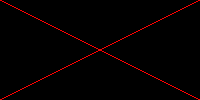

# Jetbrains Academy - Seam Carving

My solutions for the Jetbrains Academy Problem Seam Carving

https://hyperskill.org/projects/100

Further info: https://en.wikipedia.org/wiki/Seam_carving

## Stage 1

We create an image of a red cross.

just execute this:

    gradle -PmainClass=stage1.MainKt run --console=plain

    Enter rectangle width:
    20
    Enter rectangle height:
    10
    Enter output image name:
    test.png

Then the test.png should be created in the root folder that looks like this:

## Stage 2

We input an image and create the negative of it.

just execute this:

    gradle -PmainClass=stage2.MainKt run --console=plain --args="-in ./src/main/resources/stage2_blue.png -out blue-neg.png"
