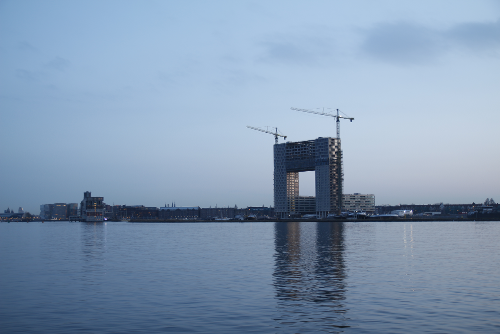
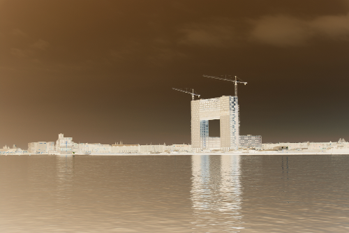
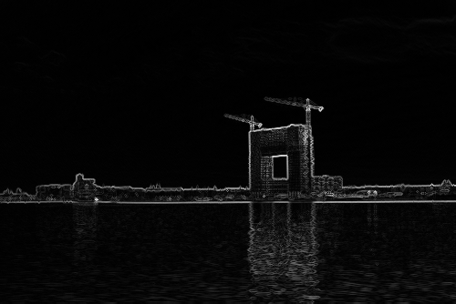
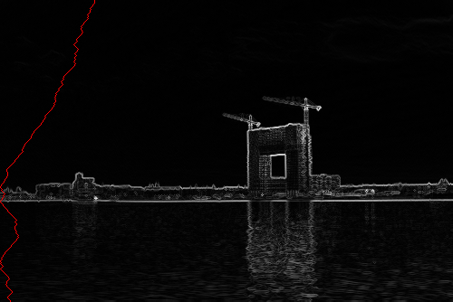
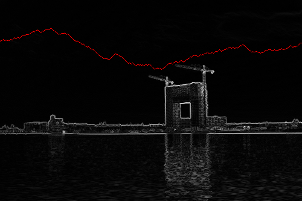
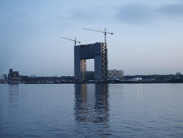

# Jetbrains Academy - Seam Carving

My solutions for the Jetbrains Academy Problem Seam Carving

https://hyperskill.org/projects/100

Further info: https://en.wikipedia.org/wiki/Seam_carving

The solution is build up step by step over several stages. 
Stage 1 is the first and simple one. The following stages 
build up on the previous stages and get more and more advanced.
There are six stages in total.

Because each stage is completely independent of the previous one,
IntelliJ might show some warnings about duplicated code between 
the stages.

## Stage 1

[click here to see description @ JetBrains Academy](https://hyperskill.org/projects/100/stages/550/implement)

We create an image of a red cross.

just execute this:

    gradle -PmainClass=stage1.MainKt run --console=plain

    Enter rectangle width:
    20
    Enter rectangle height:
    10
    Enter output image name:
    test.png

Then the test.png should be created in the root folder that looks like this:

## Stage 2

[click here to see description @ JetBrains Academy](https://hyperskill.org/projects/100/stages/551/implement)

We input an image and create the negative of it.

just execute this:

    gradle -PmainClass=stage2.MainKt run --console=plain --args="-in ./src/main/resources/blue.png -out blue-negative.png"

the input image:

the resulting image:

## Stage 3

[click here to see description @ JetBrains Academy](https://hyperskill.org/projects/100/stages/552/implement)

We input an image and create the energy map of it.

just execute this:

    gradle -PmainClass=stage3.MainKt run --console=plain --args="-in ./src/main/resources/blue.png -out blue-energy.png"

the input image:

the resulting image:

## Stage 4

[click here to see description @ JetBrains Academy](https://hyperskill.org/projects/100/stages/553/implement)

We input an image and create a new version of it where the vertical seam is shown as a red line from top to bottom.

just execute this:

    gradle -PmainClass=stage4.MainKt run --console=plain --args="-in ./src/main/resources/blue.png -out blue-seam.png"

the input image:

the resulting image:

## Stage 5

[click here to see description @ JetBrains Academy](https://hyperskill.org/projects/100/stages/554/implement)

We input an image and create a new version of it where the horizontal seam is shown as a red line from left to right.

just execute this:

    gradle -PmainClass=stage5.MainKt run --console=plain --args="-in ./src/main/resources/blue.png -out blue-seam-horizontal.png"

the input image:

the resulting image:

## Stage 6 

[click here to see description @ JetBrains Academy](https://hyperskill.org/projects/100/stages/555/implement)

We input an image and do some content-aware resizing with it by 
removing vertical and horizontal seams.

just execute this (one line):

ATTENTION: "width" is NOT the new width of the resulting image but 
rather the number of pixels we remove in the width, same with "height"

    gradle -PmainClass=stage6.MainKt run --console=plain 
        --args="-in ./src/main/resources/blue.png -out blue-reduced.png
                -width 125 -height 50"

the input image:

the resulting image (125 pixels were cut in the left/right dimension 
and 50 pixels were cut in the top/bottom dimension):

